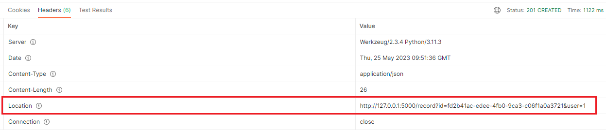

Задача 2

Последовательность установки:

1) Склонировать репозиторий music_app_task_2. Перейти в папку music_app_task_2 в терминале.
2) Запустить команду ```docker compose -f docker-compose.yml build```
3) Запустить команду ```docker compose up```
4) Т.к. проект тестовый, то в репозиторий добавлен файл .env со всеми переменными окружения, поэтому они будут установлены по умолчанию.

Как проверить работоспособность:

1) В Postman создать новый POST запрос. В 'Body' выбрать 'raw' и контент тайп 'JSON', добавить контент вида ```{"user_name": string}``` и отправить запрос на http://127.0.0.1:5000/register, что создаст юзера с заданным именем, сгенерирует уникальный идентификатор пользователя в виде
```pk = user_id``` и UUID токен доступа в виде строки. Вернет сгенерированный идентификатор пользователя и токен или ошибку, полученную при валидации. Пример валидного ответа ->
```
{
     "status": "success",
     "user_id": 1,
     "user_access_token": "ddac04ab-2f65-4c6a-8d8e-57b699299a5b"
}
```

2) Создать новый POST запрос, как показано на картинке ниже ->


В ответ придет JSON, который содержит 'status' запроса, а ссылка на ресурс будет содержаться в хэдере 'Location'. Также может вернуть ошибку,
полученную при валидации. Пример валидного ответа ->
```
{
     "status": "success"
}
```
Вкладка Headers (ответа) в Postman ->


3) Чтобы скачать запись нужно создать GET запрос и отправить по ссылке, полученной в пункте 2. Когда вернется ответ, нужно нажать на поле в правом нижнем углу и скачать файл ->


Также может вернуться ошибка, возникшая в процессе обработки запроса.

Чтобы проверить, что информация сохраняется на хост машине нужно создать юзера (также можно сохранить несколько .wav файлов) 
в БД путем отправки валидного запроса на эндпоинты выше. После этого остановить контейнеры при помощи ```CTRL + C``` или используя
приложение Docker. Далее запустить проект снова используя команду ```docker compose up```. В контейнере под названием ```postgres_music_app```
будет БД с именем ```music_app_db```, в ней проверить наличие данных в таблице ```users``` или ```tracks``` (желательно не выбирать атрибут ```track_file_bin``` из данной таблицы). Постгрес юзер -> ```postgres```
